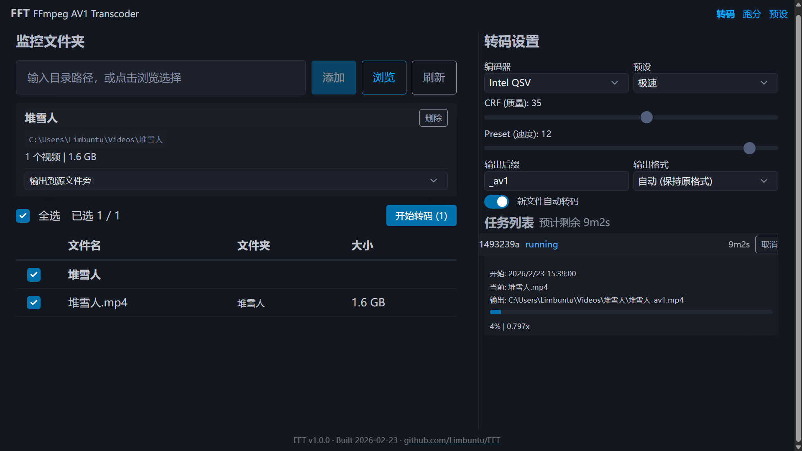

# FFT — FFmpeg AV1 Transcoder

基于 Web 的视频转码工具，专注 AV1 编码。支持硬件加速、批量转码、编码器跑分对比和监控文件夹自动转码。




## 功能特性

- **多编码器支持** — SVT-AV1、libaom-av1、rav1e，以及 NVIDIA/Intel/AMD 硬件加速编码器
- **硬件自动检测** — 自动识别系统可用的编码器和 GPU
- **批量转码** — 监控文件夹，选择文件批量转码，实时进度和 ETA 显示
- **编码器跑分** — 对比不同编码器的性能和压缩率，支持排行榜
- **预设管理** — 内置多种预设（极速/均衡/高质量/无损），支持自定义
- **实时反馈** — WebSocket 实时推送转码进度、速度、剩余时间
- **自动转码** — 监控文件夹新增文件时自动开始转码
- **日志系统** — 自动记录运行日志（含 ffmpeg 详细输出），支持一键下载，路径和文件名自动脱敏保护隐私
- **格式兼容** — 自动检测不兼容 AV1 的容器格式（如 MOV），自动回退为 MP4 并提示

## 快速开始

### Docker（推荐）

```bash
docker run -d -p 8166:8166 -v ./videos:/videos ghcr.io/limbuntu/fft:latest
```

或使用 Docker Compose：

```yaml
# docker-compose.yml
services:
  fft:
    image: ghcr.io/limbuntu/fft:latest
    ports:
      - "8166:8166"
    volumes:
      - ./videos:/videos
    restart: unless-stopped
```

```bash
docker compose up -d
```

GPU 版本（需要 NVIDIA Docker Runtime）：

```bash
docker run -d -p 8166:8166 --gpus all -v ./videos:/videos ghcr.io/limbuntu/fft:gpu
```

或使用 Docker Compose：

```bash
docker compose -f docker-compose.yml -f docker-compose.gpu.yml up -d
```

Intel Arc GPU 版本（适用于 Intel Arc / 核显，需要宿主机已安装 Intel GPU 驱动）：

> **⚠️ 暂不支持飞牛OS。** 宿主机需要 Debian 13+ 或 Ubuntu 24.10+ 才能正确驱动 Intel Arc 系列显卡。

```bash
docker run -d -p 8166:8166 --device /dev/dri:/dev/dri -v ./videos:/videos ghcr.io/limbuntu/fft:intel
```

或使用 Docker Compose：

```bash
docker compose -f docker-compose.intel.yml up -d
```

### 桌面版

从 [Releases](https://github.com/Limbuntu/FFT/releases) 下载对应平台的压缩包：

| 平台 | 完整版（含 FFmpeg） | 精简版（需自装 FFmpeg） |
|------|---------------------|------------------------|
| Windows x64 | `FFT-windows-x64-full.zip` | `FFT-windows-x64-lite.zip` |
| macOS arm64 | — | `FFT-macos-arm64.tar.gz` |

macOS 版需要自行安装 FFmpeg：`brew install ffmpeg`

> macOS 首次运行前需移除系统隔离属性：`xattr -rd com.apple.quarantine ~/Downloads/FFT/`

解压后运行 `FFT`（macOS）或 `FFT.exe`（Windows），浏览器会自动打开。

### 从源码运行

```bash
git clone https://github.com/Limbuntu/FFT.git
cd FFT
pip install -r requirements.txt
uvicorn app.main:app --host 0.0.0.0 --port 8166
```

需要系统已安装 `ffmpeg` 和 `ffprobe`。

## 项目结构

```
FFT/
├── app/                # 后端（FastAPI）
│   ├── main.py         # 应用入口
│   ├── api.py          # REST API 路由
│   ├── transcoder.py   # 转码引擎
│   ├── benchmark.py    # 跑分测试
│   ├── hardware.py     # 硬件检测
│   ├── presets.py      # 预设管理
│   ├── watchfolders.py # 监控文件夹
│   ├── logging_config.py # 日志配置
│   └── ws.py           # WebSocket 广播
├── static/             # 前端（Vue 3 + Pico CSS）
├── Dockerfile          # CPU Docker 镜像
├── Dockerfile.gpu      # NVIDIA GPU Docker 镜像
├── Dockerfile.intel    # Intel Arc/核显 Docker 镜像
├── fft.spec            # PyInstaller 打包配置
├── run.py              # 桌面版启动入口
└── requirements.txt    # Python 依赖
```

## 环境变量

| 变量 | 默认值 | 说明 |
|------|--------|------|
| `FFT_PORT` | `8166` | 监听端口 |

## 技术栈

- **后端** — Python 3.12 / FastAPI / Uvicorn / WebSocket
- **前端** — Vue 3 / Pico CSS
- **转码** — FFmpeg
- **打包** — PyInstaller / Docker

## Roadmap

- [ ] 集成视频质量评估指标（VMAF / SSIM / PSNR），转码完成后自动进行画质对比分析
- [x] 任务列表增加详细日志输出，支持查看每个任务的完整 FFmpeg 执行日志
- [ ] 新增音频转码选项，支持独立配置音频编码器、码率、采样率等参数
- [ ] 前端界面视觉重构，优化交互体验与整体布局设计

## 转码效果示例

以 iPhone 16 Pro 拍摄的 4K 60fps HDR 视频为例（HEVC → AV1，CRF 28，Preset 8）：

| 项目         | IMG_2634.MOV (原始)                   | IMG_2634_av1.mp4 (转码后)             |
|--------------|---------------------------------------|---------------------------------------|
| 封装格式     | QuickTime MOV                         | MP4 (ISOM)                            |
| 文件大小     | 44 MB                                 | 13 MB                                 |
| 总码率       | 53.4 Mbps                             | 15.3 Mbps                             |
| 视频编码     | H.265/HEVC (Main 10)                  | AV1 (Main, libsvtav1)                 |
| 视频码率     | 52.7 Mbps                             | 15.1 Mbps                             |
| 分辨率       | 3840x2160 (含旋转-90°)                | 2160x3840 (已旋转写入)                |
| 帧率         | 60fps                                 | 60fps                                 |
| 像素格式     | yuv420p10le (10bit)                   | yuv420p10le (10bit)                   |
| 色彩空间     | BT.2020 / HLG                         | BT.2020 / HLG                         |
| B帧          | 有 (has_b_frames=2)                   | 无 (has_b_frames=0)                   |
| 音频编码     | AAC LC, 立体声, 48kHz                 | AAC LC, 立体声, 48kHz (一致)          |
| 额外音轨     | 4声道 Apple Spatial Audio (apac)      | 无 (丢失)                             |
| Dolby Vision | 有 (Profile 8, 兼容HLG)              | 无 (丢失)                             |
| 元数据轨道   | 6条 (陀螺仪、GPS等)                   | 无 (丢失)                             |
| 设备信息     | iPhone 16 Pro, iOS 26.3               | 无 (丢失)                             |

> **注意：** AV1 转码后会丢失部分元数据，请根据需要自行修改 ffmpeg 预设

